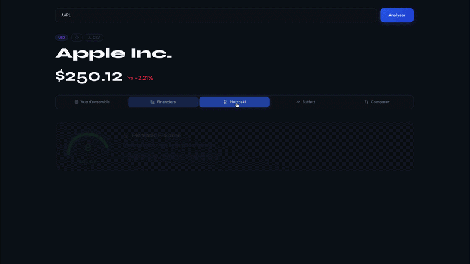

# Stock Analysis Dashboard

Dashboard d'analyse boursière avec calcul du **Piotroski F-Score**, **Buffett Indicator**, comparaison multi-tickers et export CSV.

> **Stack :** FastAPI (Python 3.12) · React 18 (Vite) · Docker

---

<!-- Pour enregistrer le GIF :
  1. Lance l'app en local (voir section Lancement)
  2. Utilise QuickTime > Nouvel enregistrement d'écran (Mac)
     ou ShareX / ScreenToGif (Windows)
  3. Enregistre ~30s de navigation (recherche, onglets, Buffett, comparaison)
  4. Convertis en GIF avec https://ezgif.com/video-to-gif
  5. Place le fichier dans docs/demo.gif et remplace la ligne ci-dessous
-->



---

## Fonctionnalités

| Onglet | Contenu |
|--------|---------|
| **Vue d'ensemble** | Prix, variation, Market Cap, P/E, Dividend Yield, Volume · Graphique 30j · 8 métriques clés |
| **Financiers** | Bénéfice net, Marge nette (avec seuil 20%), Dividendes sur 5 ans |
| **Piotroski F-Score** | Jauge 0–9 · 9 critères détaillés (Rentabilité, Levier, Efficacité) |
| **Buffett Indicator** | Market Cap / GDP pour US, Zone Euro, UK, Japon · Données Banque Mondiale |
| **Comparer** | Tableau KPIs côte à côte pour jusqu'à 4 tickers · Coloration meilleur/moins bon |

**Autres fonctionnalités**
- Recherche par ticker ou nom de société avec autocomplete
- Favoris persistés en localStorage
- Export CSV complet (KPIs + Piotroski + historique + dividendes)
- Cache serveur TTL 5 min (cachetools)
- Rate limiting (10 req/min sur `/analyze`, 30 req/min sur `/search`)
- Design système complet (CSS modules + tokens CSS)

---

## Architecture

```
Stock_analysis/
├── backend/                        # API FastAPI
│   ├── main.py                     # App + CORS + rate limiter
│   ├── core/
│   │   ├── config.py               # Settings (ALLOWED_ORIGINS via .env)
│   │   └── limiter.py              # Instance slowapi partagée
│   ├── routes/
│   │   ├── analysis_routes.py      # GET /api/analyze/{ticker}
│   │   ├── buffet_routes.py        # GET /api/buffett-indicator
│   │   ├── health_routes.py        # GET /health
│   ├── services/
│   │   └── stock_service.py        # Logique métier yfinance + Piotroski
│   ├── models/
│   │   └── schemas.py              # Pydantic schemas
│   ├── tests/                      # pytest (25 tests)
│   ├── requirements.txt
│   └── .env                        # Non commité — voir Configuration
│
└── stock-dashboard/                # Frontend React (Vite)
    └── src/
        ├── App.jsx                 # Shell principal
        ├── styles/tokens.css       # Design tokens CSS
        ├── tabs/                   # 5 onglets isolés
        ├── components/ui/          # Badge, KpiCard, MetricRow…
        ├── hooks/                  # useFavorites, useIsMobile
        └── utils/                  # Formatters, exportUtils
```

**Flux de données**

```
React → GET /api/analyze/{ticker}
             ↓
        StockDataService
             ├── yfinance (prix, KPIs, historique, dividendes)
             └── Piotroski F-Score (9 critères)
             ↓
        TTLCache (5 min) → SafeJSONResponse
```

---

## Lancement

### Prérequis

- Python 3.12+
- Node.js 20+
- Docker & Docker Compose (optionnel)

---

### Option 1 — Docker (recommandé)

```bash
# Copier et configurer le .env backend
cp backend/.env.example backend/.env   # ou créer le fichier manuellement

docker compose up --build
```

- Frontend : http://localhost:3000
- Backend  : http://localhost:8000
- Swagger  : http://localhost:8000/docs

---

### Option 2 — Local

**Backend**

```bash
python -m venv venv
source venv/bin/activate        # Mac/Linux
# venv\Scripts\activate         # Windows

pip install -r backend/requirements.txt

cd backend
uvicorn main:app --reload --port 8000
```

**Frontend**

```bash
cd stock-dashboard
npm install
npm start                       # http://localhost:3000
```

---

## Configuration

Créer `backend/.env` (non commité) :

```env
# Origines autorisées pour le CORS
# En développement :
ALLOWED_ORIGINS=*

# En production (remplacer par l'URL réelle du frontend) :
# ALLOWED_ORIGINS=https://mon-app.onrender.com
```

Créer `stock-dashboard/.env` (non commité) :

```env
VITE_API_URL=http://localhost:8000
```

---

## Tests

```bash
# Backend (25 tests)
pip install -r backend/requirements-dev.txt
pytest backend/tests/

# Frontend
cd stock-dashboard
npm install
npm test
```

---

## API

| Méthode | Endpoint | Description | Limite |
|---------|----------|-------------|--------|
| `GET` | `/health` | Health check | — |
| `GET` | `/api/analyze/{ticker}` | Analyse complète + Piotroski | 10/min |
| `GET` | `/api/search/{query}` | Autocomplete tickers | 30/min |
| `GET` | `/api/buffett-indicator` | Buffett Indicator (4 pays) | 20/min |

**Exemple**

```bash
curl http://localhost:8000/api/analyze/AAPL
curl http://localhost:8000/api/search/Apple
```

---

## Piotroski F-Score

Système de scoring financier sur **9 critères** (Joseph Piotroski, 2000) :

| Catégorie | Critères |
|-----------|----------|
| **Rentabilité** (4 pts) | ROA positif · CFO positif · ROA en hausse · CFO > Bénéfice net |
| **Levier / Liquidité** (3 pts) | Levier en baisse · Current ratio positif · Pas de dilution |
| **Efficacité** (2 pts) | Marge brute en hausse · Rotation des actifs en hausse |

| Score | Interprétation |
|-------|----------------|
| ≥ 7 | Entreprise solide |
| 4 – 6 | Potentiel — analyse approfondie recommandée |
| < 4 | Signaux faibles — prudence |

---

## Stack technique

| Couche | Technologies |
|--------|-------------|
| **Backend** | Python 3.12 · FastAPI 0.118 · Uvicorn · yfinance · pandas · cachetools · slowapi |
| **Frontend** | React 18 · Vite 5 · Recharts · Lucide React · CSS Modules |
| **Données** | Yahoo Finance (yfinance) · Banque Mondiale API |
| **Tests** | pytest · pytest-asyncio · vitest |
| **Infra** | Docker · Docker Compose |

---

## Déploiement production

Le projet est déployable sur [Render](https://render.com), [Railway](https://railway.app) ou tout autre hébergeur Docker.

**Points à configurer avant de déployer :**

```env
# backend/.env
ALLOWED_ORIGINS=https://ton-frontend.com
```

```env
# stock-dashboard/.env
VITE_API_URL=https://ton-backend.com
```

---

## Ressources

- [Documentation FastAPI](https://fastapi.tiangolo.com/)
- [yfinance](https://pypi.org/project/yfinance/)
- [Piotroski F-Score — Wikipedia](https://en.wikipedia.org/wiki/Piotroski_F-score)
- [Buffett Indicator — Wikipedia](https://en.wikipedia.org/wiki/Buffett_indicator)
- [World Bank API](https://datahelpdesk.worldbank.org/knowledgebase/articles/889392)
- [Recharts](https://recharts.org/)

---

## Licence

MIT — libre d'utilisation pour vos projets personnels et commerciaux.
